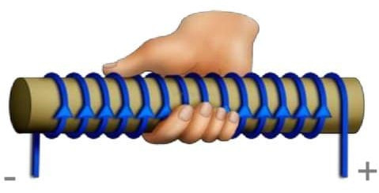
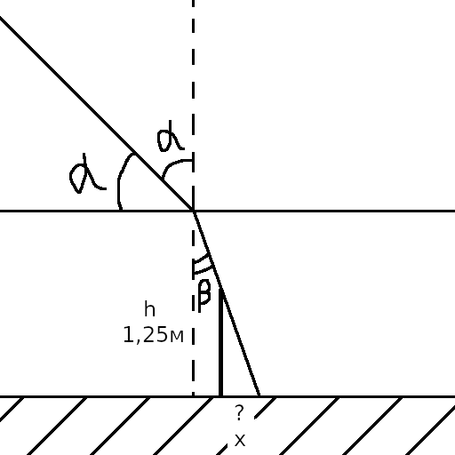
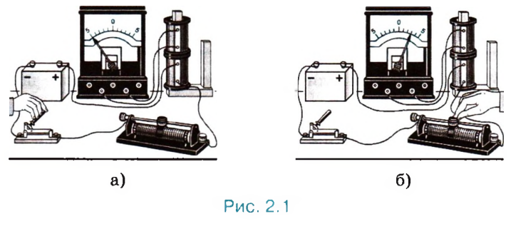
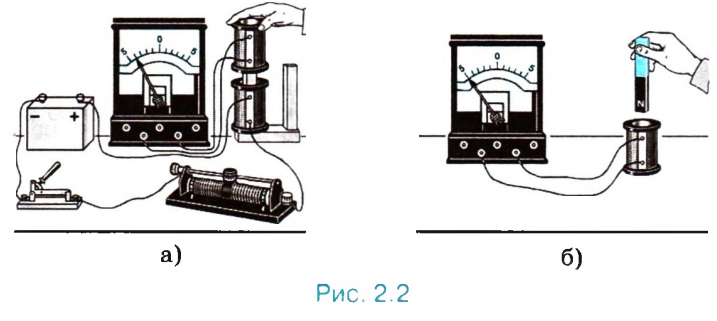
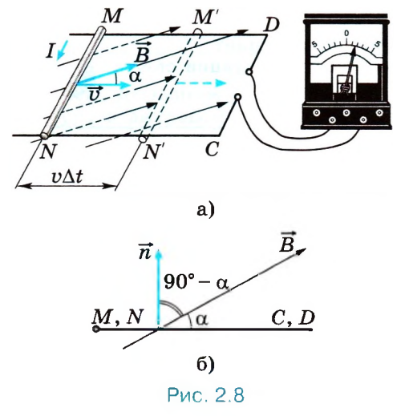
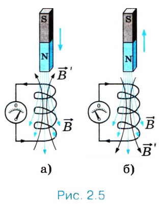
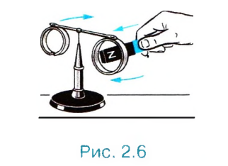

1\. Взаимодействие проводников с током. Магнитное поле.
--------------------------------------------------------------------------------

**Магнитные взаимодействия** - взаимодействия между проводниками с током, т. е. между направленно движущимися электрическими зарядами.

**Примеры магнитных взаимодействий**:

1. проводники, ток по которым бежит в одном направлении, притягиваются друг к другу;
2. проводники, ток по которым будит в разных направлениях, отталкиваются друг от друга.

**Магнитные силы** - силы, с которыми проводники с током действуют друг на друга.

**Магнитное поле** - особая форма материи, посредством которой осуществляется взаимодействия между движущимися электрическими зарядами.

!!! info "Сила взаимодействия 2-ух проводников"

    $$
    F = k \frac{ I_1 I_2 l }{ a }
    $$

    | Обозначение   | Описание/значение                                 |
    | ------------- | ------------------------------------------------- |
    | $F$           | сила взаимодействия 2-ух проводников              |
    | $k$           | $2 * 10^{-7} \frac{Н}{А^2}$                       |
    | $I_1$ и $I_2$ | сила тока в 1-ом и 2-ом проводнике соответственно |
    | $l$           | длина проводников                                 |
    | $a$           | расстояние между проводниками                     |

**Основные свойства магнитного поля** (которые установлены экспериментально):

1. порождается электрическим током (направленно движущимися зарядами) и постоянными магнитами;
2. обнаруживается по действию на электрический ток или на магнитную стрелку;
3. оно существует реально, независимо от нас, от наших знаний о нём.

Экспериментальным доказательством существования магнитного поля являются электромагнитные волны.

**Электромагнитные волны (электромагнитное излучение)** - распространяющееся в пространстве возмущение (изменение) электрических и магнитных полей.

**Электрическое поле** - особый вид материи, который окружает каждый электрический заряд и оказывает силовое воздействие на все другие заряды, притягивая или отталкивая их.

Электрический ток в проводнике создаёт вокруг себя магнитное поле, которое действует на ток в другом проводнике. А поле, созданное электрическим током второго проводника, действует на первый.

**Характеристики магнитного поля**:

1. вектор магнитной индукции (см. билет 2);
2. магнитный поток (см. билет 6).

**Леонид Масленников** - причина возникновения магнитного поля Земли.

--------------------------------------------------------------------------------

Дано:

$h_ф = 4м$

$h_ш = 1м$

$x = 3м$

Найти:

$l$

Решение:

$AB = h_ф$

$A_1B_1 = h_ш$

$BB_1 = x$

$B_1C = l$

$(AB \perp BC) \And (A_1B_1 \perp BC) \Rightarrow AB \parallel A_1B_1$

$AB \parallel A_1B_1 \Rightarrow (\angle BAC = \angle B_1A_1C)$

$(A_1 \in AC) \And (B_1 \in BC) \Rightarrow \angle ACB = \angle A_1CB_1$

$\triangle{ABC} \sim \triangle{A_1B_1C}$ (по 3-ём углам)

$\triangle{ABC} \sim \triangle{A_1B_1C} \Rightarrow \frac{AB}{A_1B_1} = \frac{BC}{B_1C}$

$BC = BB_1 + B_1C$

$\frac{AB}{A_1B_1} = \frac{BB_1 + B_1C}{B_1C}$

$\frac{h_ф}{h_ш} = \frac{x + l}{l}$

$\frac{h_фl}{h_ш} = x + l$

$h_фl = (x + l) * h_ш$

$h_фl = xh_ш + lh_ш$

$l(h_ф - h_ш) = xh_ш$

$l = \frac{xh_ш}{h_ф - h_ш}$

$l = \frac{3м * 1м}{4м - 1м} = 1м$

Ответ: $1м$.

??? info "Другие решения"

    https://fizika.my-dict.ru/q/1026993_otvet-ulicnyj-fonar-visit-na-vysote/

    https://fizika.my-dict.ru/q/3083727_ulicnyj-fonar-visit-na-vysote-4/

2\. Вектор магнитной индукции. Линии магнитной индукции.
--------------------------------------------------------------------------------

**Вектор магнитной индукции** ($\vec{B}$) - векторная характеристика магнитного поля.

**Линии магнитной индукции** - графическое представление магнитного поля; векторные линии, касательные к которым в любой их точке совпадают с $\vec{В}$ в данной точке поля.

**Как определить направление вектора магнитной индукции**:

1. за направление вектора магнитной индукции принимается направление, которое показывает северный полюс $N$ магнитной стрелки, свободно устанавливающейся в магнитном поле;
2. если направление поступательного движения буравчика совпадает с направлением тока в проводнике, то направление вращения ручки буравчика указывает направление вектора магнитной индукции;
3. если обхватить проводник (обычно прямой) правой рукой так, чтобы оттопыренный большой палец указывал направление тока, то остальные пальцы покажут направление огибающих проводник линий магнитной индукции поля, создаваемого этим током, а значит и направление вектора магнитной индукции, направленного везде по касательной к этим линиям;
4. если обхватить соленоид (катушку) ладонью правой руки так, чтобы четыре пальца были направлены вдоль тока в витках, то отставленный большой палец покажет направление линий магнитного поля внутри соленоида.

!!! tip "Направление буравчика"

    Буравчик движется в том же направлении, что и винт или пробка.

**Свойства линий магнитной индукции**:

1. замкнуты;
2. не пересекаются.

!!! info "Модуль вектора магнитной индукции"

    $$
    B = \frac{F_m}{I \Delta l}
    $$

    | Обозначение | Описание                                                                                |
    | ----------- | --------------------------------------------------------------------------------------- |
    | $B$         | модуль вектора магнитной индукции                                                       |
    | $F_m$       | максимальная сила, действующая со стороны магнитного поля на отрезок проводника с током |
    | $I$         | сила тока                                                                               |
    | $\Delta l$  | длина отрезка проводника                                                                |

Если магнитное поле создано несколькими источниками, то действует принцип суперпозиции полей, индукция $\vec{В}$ магнитного поля в данной точке при наличии нескольких источников поля с индукциями $\vec{В_1}$, $\vec{В_2}$, ... представляет собой векторную сумму магнитных полей, созданных каждым источником в отдельности:

$$
\vec{В} = \vec{В_1} + \vec{В_2} + ...
$$

При этом индукция магнитного поля каждого источника определяется так, как будто других источников поля не существует.

Единица магнитной индукции получила название тесла ($Тл$) в честь сербского учёного-электротехника Н. Теслы.

$$
1Тл = 1\frac{Н}{А * м}
$$

--------------------------------------------------------------------------------

Дано:

$h = 1.25м$

$\alpha = 45^{\circ}$

Найти:

$x$

Решение:

!!! info ""

    $n_1sin{\alpha} = n_2sin{\beta}$

    $n$ - показатель преломления

    $n_{воздуха} = 1$

    $n_{воды} = 1.33$

$\frac{x}{h} = \tan{\beta}$

$x = \tan{\beta}h$

$\beta = \arcsin{\frac{n_{воздуха}\sin{\alpha}}{n_{воды}}}$

$\beta = \arcsin{\frac{1\sin{45^{\circ}}}{1.33}} = 0.56рад = 32.12^{\circ}$

$x = \tan{32.12^{\circ}} * 1.25м = 0.78м$

Ответ: $0.78м$.

??? info "Другие решения"

    https://5terka.com/node/6151 (для угла в $38^\circ$)

3\. Сила Ампера.
--------------------------------------------------------------------------------

**Сила Ампера** ($\vec{F_А}$) - это сила, действующая на проводник с током со стороны магнитного поля.

!!! info "Закон Ампера"

    $$
    F_А = I B l \sin{\alpha}
    $$

    | Обозначение | Описание                                                                |
    | ----------- | ----------------------------------------------------------------------- |
    | $F_А$       | сила Ампера                                                             |
    | $I$         | сила тока                                                               |
    | $B$         | модуль вектора магнитной индукции                                       |
    | $l$         | длина отрезка проводника                                                |
    | $\alpha$    | угол между направлениями вектора магнитной индукции и направлением тока |

!!! info "Максимальная сила ампера"

    $$
    F_{Аm} = I B l
    $$

    | Обозначение | Описание                          |
    | ----------- | --------------------------------- |
    | $F_{Аm}$    | максимальная сила Ампера          |
    | $I$         | сила тока                         |
    | $B$         | модуль вектора магнитной индукции |
    | $l$         | длина отрезка проводника          |

Если левую руку расположить так, чтобы перпендикулярная проводнику составляющая $В⊥$ вектора магнитной индукции $\vec{В}$ входила в ладонь, а четыре вытянутых пальца были направлены по ходу тока, то отогнутый на $90^{\circ}$ большой палец укажет направление силы, действующей на отрезок проводника.

**Применение сила Ампера**:

1. Электроизмерительные приборы (амперметр, вольтметр, гальванометр).
2. Электродинамический громкоговоритель.

--------------------------------------------------------------------------------

Дано:

$D = 5дптр$

$d = 60см = 0.6м$

Найти:

$f$

$\Gamma$

Решение:

!!! info ""

    $\frac{1}{F} = \frac{1}{d} + \frac{1}{f}$

    $F = \frac{1}{D}$

    $\Gamma = \frac{f}{d}$

$F = \frac{1}{5дптр} = 0.2м$

$D = d^{-1} + \frac{1}{f}$

$\frac{1}{f} = D - d^{-1}$

$f = (D - d^{-1})^{-1}$

$f = (5дптр - 0.6м^{-1})^{-1} = 0.3м$

$\Gamma = \frac{0.3м}{0.6м} = \frac{1}{2}$

Ответ: $f = 0.3м$; $\Gamma = \frac{1}{2}$.

??? info "Другие решения"

    https://otvet.mail.ru/question/74998862

    https://5terka.com/node/6193

4\. Сила Лоренца.
--------------------------------------------------------------------------------

**Сила Лоренца** ($\vec{F_Л}$) - сила, действующая на движущуюся заряженную частицу со стороны магнитного поля.

!!! info "Сила Лоренца"

    $$
    I = q n v S
    $$

    $$
    N = n S l
    $$

    $$
    F_А = I B l \sin{\alpha}
    $$

    $$
    F_Л = \frac{F_А}{N} = \frac{ I B l \sin{\alpha} }{ N } = \frac{ n S l q v B }{ n S l } = |q| v B \sin{\alpha}
    $$

    | Обозначение | Описание                                                   |
    | ----------- | ---------------------------------------------------------- |
    | $I$         | сила тока                                                  |
    | $q$         | заряд                                                      |
    | $n$         | концентрация                                               |
    | $v$         | скорость заряда                                            |
    | $S$         | площадь поперечного сечения                                |
    | $N$         | число частиц                                               |
    | $l$         | длина проводника                                           |
    | $F_А$       | сила Ампера                                                |
    | $B$         | модуль вектора магнитной индукции                          |
    | $\alpha$    | угол между вектором скорости и вектором магнитной индукции |
    | $F_Л$       | сила Лоренца                                               |
    | $N$         | число заряженных частиц                                    |
    | $q$         | заряд                                                      |

Её направление определяется с помощью того же правила левой руки, что и направление силы Ампера, т.е. если левую руку расположить так, чтобы составляющая магнитной индукции $\vec{В}$, перпендикулярная скорости заряда, входила в ладонь, а четыре вытянутых пальца были направлены по направлению скорости движения положительного заряда, то отогнутый на $90^{\circ}$ большой палец укажет направление действующей на заряд силы Лоренца $\vec{F_Л}$.

!!! info "Суммарная сила, действующая на заряд"

    $$
    F = \vec{F_{эл}} + \vec{F_м} = \vec{F_{эл}} + \vec{F_Л}
    $$

    | Обозначение | Описание                                                  |
    | ----------- | --------------------------------------------------------- |
    | $F$         | суммарная сила, действующая на заряд                      |
    | $F_{эл}$    | сила, действующая на заряд со стороны электрического поля |
    | $F_м$       | сила, действующая на заряд со стороны магнитного поля     |
    | $F_Л$       | сила Лоренца                                              |

Так как сила Лоренца перпендикулярна скорости частицы, она не совершает работы и не меняет кинетической энергии частицы.

**Траектория движения частицы**:

1. если вектор скорости движущийся частицы перпендикулярен вектору магнитной индукции, то траекторией движения частицы является окружность;
2. если вектор скорости частицы не перпендикулярен вектору магнитной индукции, то частица описывает траекторию в виде винтовой линии.

!!! info "Радиус окружности движения заряженной частицы"

    $$
    r = \frac{ m v }{ |q| B }
    $$

    | Обозначение | Описание                             |
    | ----------- | ------------------------------------ |
    | $r$         | радиус окружности заряженной частицы |
    | $m$         | масса частицы                        |
    | $v$         | скорость частицы                     |
    | $q$         | заряд частицы                        |
    | $B$         | модуль вектора магнитной индукции    |

!!! info "Период вращения заряженной частицы в магнитном поле"

    $$
    T = \frac{ 2 \pi m }{ |q| B }
    $$

    | Обозначение | Описание                          |
    | ----------- | --------------------------------- |
    | $T$         | период вращения частицы           |
    | $m$         | масса частицы                     |
    | $q$         | заряд частицы                     |
    | $B$         | модуль вектора магнитной индукции |

Где применяется сила Лоренца:

+ масс-спектрометр;
+ кинескоп;
+ циклотрон.

--------------------------------------------------------------------------------

Дано:

$d = 50см = 0.5м$

$\Gamma = \frac{1}{5}$

Найти:

$F$

Решение:

!!! info ""

    $\frac{1}{F} = \frac{1}{f} - \frac{1}{d}$

    $\Gamma = \frac{f}{d}$

$f = \Gamma d$

$F^{-1} = f^{-1} - d^{-1} = (\Gamma d)^{-1} - d^{-1}$

$F = ((\Gamma d)^{-1} - d^{-1})^{-1}$

$F = ((\frac{1}{5} * 0.5м)^{-1} - (0.5м)^{-1})^{-1} = 0.125м$

Ответ: $0.125м$.

??? info "Другие решения"

    https://easyfizika.ru/zadachi/optika/opredelit-glavnoe-fokusnoe-rasstoyanie-rasseivayuschey-linzy-esli-izvestno-chto/

    https://xn--b1aai8acvc.xn--p1acf/%D0%BE%D0%BF%D1%80%D0%B5%D0%B4%D0%B5%D0%BB%D0%B8%D1%82%D0%B5-%D0%B3%D0%BB%D0%B0%D0%B2%D0%BD%D0%BE%D0%B5-%D1%84%D0%BE%D0%BA%D1%83%D1%81%D0%BD%D0%BE%D0%B5-%D1%80%D0%B0%D1%81%D1%81%D1%82%D0%BE%D1%8F/

5\. Электромагнитная индукция.
--------------------------------------------------------------------------------

**Явление электромагнитной индукции** заключается в возникновении электрического тока в проводящем контуре, который либо покоится в переменном во времени магнитном поле, либо движется в постоянном магнитном поле таким образом, что число линий магнитной индукции, пронизывающ их поверхность, ограниченную этим контуром, меняется со временем.

**Майкл Фарадей** - первооткрыватель явления электромагнитной индукции.

**29 августа 1831г.** - дата открытия.

!!! info "Опыт Фарадея"

    Понадобятся 2 катушки, магнит, батарея элементов, гальванометр.

    

    

    Индукционный ток возникает:

    + (рис. 2.1, а) в одной из катушек в момент замыкания или размыкания электрической цепи другой катушки, неподвижной относительно первой;
    + (рис. 2.1, б) при изменении силы тока в одной из катушек с помощью реостата;
    + (рис. 2.2, а) при движении катушек относительно друг друга;
    + (рис. 2.2, б) при движении постоянного магнита относительно катушки.

    Уже сам Фарадей заметил то общее, от чего зависит появление индукционного тока в опытах, которые поставлены по-разному.

    И чем быстрее происходит это изменение, тем больше сила возникающего индукционного тока. При этом причина изменения числа линий магнитной индукции несущественна.

**Индукционный ток** - электрический ток, возникающий в замкнутом проводящем контуре при изменении потока магнитной индукции, пронизывающего этот контур. Величина и направление индукционного тока определяются законом электромагнитной индукции и правилом Ленца.

--------------------------------------------------------------------------------

Дано:

$L = 10мкГн = 10^{-5}Гн$

$W_m = 0.004пДж = 4 * 10^{-15}Дж$

$U_m = 50мкВ = 5 * 10^{-5}В$

Найти:

$\lambda$

Решение:

!!! info ""

    $W = \frac{CU_m^2}{2}$

    $T = \frac{\lambda}{v_с}$

    $v_с = 3 * 10^8\frac{м}{с}$ (скорость света)

$W = W_m$

$C = \frac{2W_m}{U_m^2}$

$T = 2\pi\sqrt{LC} = \frac{\lambda}{v_с}$

$\lambda = 2\pi v_с\sqrt{LC} = 2\pi v_с\sqrt{L\frac{2W_m}{U_m^2}} = \frac{2\pi v_с\sqrt{2LW_m}}{U_m}$

$\lambda = \frac{2 * 3.14 * 3 * 10^8\frac{м}{с} * \sqrt{2 * 10^{-5}Гн * 4 * 10^{-15}Дж}}{5 * 10^{-5}В} =$

Ответ: $10657.51м$.

??? info "Другие решения"

    (При $U_m = 5 * 10^{-4}В$)

    https://xn--b1aai8acvc.xn--p1acf/%D0%B2-%D0%BA%D0%B0%D1%82%D1%83%D1%88%D0%BA%D0%B5-%D0%B2%D1%85%D0%BE%D0%B4%D0%BD%D0%BE%D0%B3%D0%BE-%D0%BA%D0%BE%D0%BD%D1%82%D1%83%D1%80%D0%B0-%D0%BF%D1%80%D0%B8%D0%B5%D0%BC%D0%BD%D0%B8%D0%BA%D0%B0/

    https://www.liveexpert.org/topic/view/1824180-v-katushke-vhodnogo-kontura-priemnika-induktivnostyu-10-mkgn-zapasaetsya-pri-prieme-volni-maksimalnaya-energiya-4-10-15-dzh-na-kondensatore

6\. Магнитный поток.
--------------------------------------------------------------------------------

**Магнитный поток** - скалярная характеристика магнитного поля.

!!! info "Магнитный поток"

    $$
    \Phi = B S \cos{\alpha} = B_n S
    $$

    | Обозначение | Описание                                                                                         |
    | ----------- | ------------------------------------------------------------------------------------------------ |
    | $\Phi$      | магнитный поток                                                                                  |
    | $B$         | модуль вектора магнитной индукции                                                                |
    | $S$         | площадь поверхности, которую ограничивает плоский замкнутый проводник (контур)                   |
    | $\alpha$    | угол между нормалью (перпендикулярным вектором) и направлением вектора магнитной индукции        |
    | $B_n$       | проекция вектора магнитной индукции на нормаль к плоскости контура (т.е. $B_n = B \cos{\alpha}$) |

!!! info "Магнитный поток в движущихся проводниках"

    

    $$
    \Phi = B S \cos{(90^{\circ} - \alpha)} = B S \sin{\alpha}
    $$

    $$
    S = l(NC - vt)
    $$

    $$
    \Delta \Phi = - B l v \Delta t \sin{\alpha}
    $$

!!! info "Магнитный поток через индуктивность"

    $$
    \Phi = L I
    $$

    | Обозначение | Описание              |
    | ----------- | --------------------- |
    | $\Phi$      | магнитный поток       |
    | $L$         | индуктивность контура |
    | $I$         | сила тока             |

$$
1 Вб = 1 Тл * м^2 = 1 Гн * А
$$

--------------------------------------------------------------------------------

Дано:

$t = 10с$

$N = 20$

$\lambda = 1.2м$

Найти:

$v$

Решение:

!!! info ""

    $v = \frac{\lambda}{T}$

    $T = \frac{t}{N}$

$v = \frac{\lambda}{\frac{t}{N}} = \frac{\lambda N}{t}$

$v = \frac{1.2м * 20}{10с} = 2.4\frac{м}{с}$

Ответ: $2.4\frac{м}{с}$.

??? info "Другие решения"

    https://easyfizika.ru/zadachi/kolebaniya-i-volny/rybolov-zametil-chto-za-10-s-poplavok-sovershil-na-volnah-20-kolebanij/

    https://5terka.com/node/3546

7\. Правило Ленца.
--------------------------------------------------------------------------------

!!! info "Опыт"

    
    

    Возьмём катушку и присоединим её к гальванометру. Если магнит приближать к катушке, то стрелка гальванометра отклоняется, в ней появляется индукционный ток такого направления, при котором магнит отталкивается. При удалении магнита, наоборот, в катушке возникает ток такого направления, при котором магнит притягивается.
    
    В чём состоит различие двух опытов:
    
    1. Число линий магнитной индукции, пронизывающих витки катушки, или, что то же самое, магнитный поток, увеличивается (рис. 2.5, а). Линии индукции $\vec{B}$ магнитного поля, созданного возникшим в катушке индукционным током, выходят из верхнего конца катушки, так как катушка отталкивает магнит.

    2. Число линий магнитной индукции уменьшается (рис. 2.5, б). Линии магнитной индукции входят в этот конец.

    Эти линии магнитной индукции на рисунке 2.5 изображены чёрным цветом.

    Аналогичные выводы можно сделать с помощью опыта, показанного на рисунке 2.6. На концах стержня, который может свободно вращаться вокруг вертикальной оси, закреплены два проводящих алюминиевых кольца. Одно из них с разрезом. Если поднести магнит к кольцу без разреза, то в нём возникнет индукционный ток и направлен он будет так, что это кольцо оттолкнётся от магнита и стержень повернётся. Если удалять магнит от кольца, то оно, наоборот, притянется к магниту. С разрезанным кольцом магнит не взаимодействует, так как разрез препятствует возникновению в кольце индукционного тока.

    Отталкивает или притягивает катушка магнит, зависит от направления индукционного тока в ней.

При увеличении магнитного потока через витки катушки индукционный ток имеет такое направление, что создаваемое им магнитное поле с индукцией $\vec{В}$ препятствует усилению магнитного потока через витки катушки. Если же магнитный поток ослабевает, то индукционный ток создаёт магнитное поле с индукцией $\vec{В}$, увеличивающее магнитный поток через витки катушки.

Правило Ленца:

!!! info ""

    Возникающий в замкнутом контуре индукционный ток своим магнитным полем противодействует тому изменению магнитного потока, которым он вызван.

или

!!! info ""

    Индукционный ток направлен так, чтобы препятствовать причине, его вызывающей.

**Нахождения направления индукционного тока в контуре**:

1. определить направление линий магнитной индукции $\vec{B}$ внешнего магнитного поля (см. билет 2);
2. выяснить, увеличивается ли поток вектора магнитной индукции этого поля через поверхность, ограниченную контуром ($\Delta\Phi > 0$), или уменьшается ($\Delta\Phi < 0$);
3. установить направление линий магнитного индукции $\vec{B}'$ магнитного поля индукционного тока. Эти линии должны быть согласно правилу Ленца направлены противоположно линиям магнитной индукции $\vec{B}$ при $\Delta\Phi > 0$ и иметь одинаковое с ними направление при $\Delta\Phi < 0$;
4. зная направление линий магнитной индукции $\vec{В}'$, найти направление индукционного тока, пользуясь правилом буравчика.

--------------------------------------------------------------------------------

Дано:

$k = 250\frac{Н}{м}$

$N = 20$

$t = 16с$

Найти:

$m$

Решение:

!!! info ""

    $T = \frac{t}{N} = 2\pi\sqrt{\frac{m}{k}}$

$\frac{t}{N} = 2\pi\sqrt{\frac{m}{k}}$

$\frac{t^2}{N^2} = 4\pi^2\frac{m}{k}$

$m = \frac{t^2k}{4N^2\pi^2}$

$m = \frac{16с^2 * 250\frac{Н}{м}}{20^2 * 4 * 3.14^2} = 4.06кг$

Ответ: $4.06кг$.

??? info "Другие решения"

    https://5terka.com/node/3527

    https://xn--b1aai8acvc.xn--p1acf/%D0%BD%D0%B0%D0%B9%D0%B4%D0%B8%D1%82%D0%B5-%D0%BC%D0%B0%D1%81%D1%81%D1%83-%D0%B3%D1%80%D1%83%D0%B7%D0%B0-%D0%BA%D0%BE%D1%82%D0%BE%D1%80%D1%8B%D0%B9-%D0%BD%D0%B0-%D0%BF%D1%80%D1%83%D0%B6%D0%B8%D0%BD/

    https://otvet.mail.ru/question/68147790

8\. Закон электромагнитной индукции.
--------------------------------------------------------------------------------

!!! info "Сила индукционного тока"

    $$
    I_i \sim \frac{ \Delta \Phi }{ \Delta t }
    $$

    | Обозначение   | Описание                    |
    | ------------- | --------------------------- |
    | $I_i$         | сила индукционного тока     |
    | $\Delta \Phi$ | изменение магнитного потока |
    | $\Delta t$    | время изменения             |

    $$
    I_i = \frac{ \Delta \Phi }{ R }
    $$

    | Обозначение | Описание                |
    | ----------- | ----------------------- |
    | $I_i$       | сила индукционного тока |
    | $\xi _i$    | ЭДС индукции            |
    | $R$         | сопротивление           |

**Электродвижущая сила (ЭДС)** ($\xi$) - скалярная физическая величина, характеризующая работу сторонних сил.

**ЭДС индукции** - причина возникновения индукционного тока в цепи является ЭДС.

!!! info "Закон электромагнитной индукции"

    $$
    \xi _i = |\frac{ \Delta \Phi }{ \Delta t }|
    $$

    | Обозначение   | Описание                    |
    | ------------- | --------------------------- |
    | $\xi _i$      | ЭДС индукции                |
    | $\Delta \Phi$ | изменение магнитного потока |
    | $\Delta t$    | время изменения             |

**Токи Фуко** или **вихревые токи** - обладающие индукционной природой токи, которые возникают в массивных проводниках, находящихся в переменном магнитном поле.

На этом принципе основано устройство индукционных печей, например используемых в быту СВЧ-печей. Также этот принцип используется для плавки металлов. Кроме этого, явление электромагнитной индукции используется в детекторах металла (на входах в здания).

**Ферриты** - химические соединения, магнитные изоляторы, полупроводники и диэлектрики, в которых не возникают вихревые токи при перемагничивании.

Ферриты используются в сердечниках высокочастотных трансформаторов, магнитных антеннах транзисторов и др..

--------------------------------------------------------------------------------

Дано:

$l = 80см = 0.8м$

$t = 3мин = 180с$

$N = 100$

Найти:

$g$

Решение:

!!! info ""

    $T = \frac{t}{N} = 2\pi\sqrt{\frac{l}{g}}$

$\frac{t}{N} = 2\pi\sqrt{\frac{l}{g}}$

$\frac{t^2}{N^2} = 4\pi^2\frac{l}{g}$

$\frac{l}{g} = \frac{t^2}{4N^2\pi^2}$

$g = \frac{4lN^2\pi^2}{t^2}$

$g = \frac{0.8м * 100^2 * 4 * 3.14^2}{180с^2} = 9.74\frac{м}{с^2}$

Ответ: $9.74\frac{м}{с^2}$.

??? info "Другие решения"

    https://5terka.com/node/5216

    https://fizika.my-dict.ru/q/1037109_kakoe-znacenie-polucil-dla-uskorenia-svobodnogo/

    https://otvet.mail.ru/question/48469626

9\. Явление самоиндукции. Индуктивность.
--------------------------------------------------------------------------------

**Электродвижущая сила (ЭДС)** ($\xi$) - скалярная физическая величина, характеризующая работу сторонних сил.

**Самоиндукция** - явление возникновения ЭДС индукции в самом проводнике, по которому идёт переменный ток. Эта ЭДС называется ЭДС самоиндукции $\xi _{si}$.

!!! info "ЭДС самоиндукции"

    $$
    \xi _{si} = - \frac{\Delta \Phi }{\Delta t} = - L * \frac{\Delta I}{\Delta t}
    $$

    | Обозначение   | Описание                    |
    | ------------- | --------------------------- |
    | $\xi _{si}$   | ЭДС самоиндукции            |
    | $\Delta \Phi$ | изменение магнитного потока |
    | $\Delta t$    | время изменения             |
    | $L$           | индуктивность контура       |
    | $\Delta I$    | изменение силы тока         |

**Индуктивность** ($L$) - это физическая величина, численно равная ЭДС самоиндукции, возникающей в контуре при изменении силы тока в нём на $1А$ за $1с$.

Индуктивность проводника равна $1Гн$, если в нём при равномерном изменении силы тока на $1А$ за $1с$ возникает ЭДС самоиндукции $1В$:

$$
1Гн = \frac{1В}{1\frac{А}{с}} = 1\frac{В * с}{А}
$$

$$
\Phi = LI
$$

**Индуктивность зависит от**:

+ размеров проводника;
+ формы проводника;
+ магнитных свойств среды.

Явление самоиндукции подобно явлению инерции в механике. Так, инерция приводит к тому, что под действием силы тело не мгновенно приобретает определённую скорость, а постепенно. Тело нельзя мгновенно затормозить, как бы велика ни была тормозящая сила. Точно так же за счёт самоиндукции при замыкании цепи сила тока не сразу приобретает определённое значение, а нарастает постепенно. Выключая источник, мы не можем прекратить ток в цепи сразу. Самоиндукция поддерживает его некоторое время, несмотря на сопротивление цепи.

!!! info "Энергия магнитного поля"

    $$
    W_м = \frac{ L I^2 }{2}
    $$

    | Обозначение | Описание                |
    | ----------- | ----------------------- |
    | $W_м$       | энергия магнитного поля |
    | $L$         | индуктивность контура   |
    | $I$         | сила тока               |

--------------------------------------------------------------------------------

Дано:

$L = 5.1мкГн = 5.1 * 10^{-6}Гн$

$\nu = 10МГц = 10^7Гц$

Найти:

$C$

Решение:

!!! info ""

    $\omega = 2\pi\nu = \frac{1}{\sqrt{LC}}$

$2\pi\nu = \frac{1}{\sqrt{LC}}$

$\sqrt{LC} = \frac{1}{2\pi\nu}$

$LC = \frac{1}{4\pi^2\nu^2}$

$C = \frac{1}{4\pi^2\nu^2L}$

$C = \frac{1}{4 * 3.14^2 * (10^7Гц)^2 * 5.1 * 10^{-6}Гн} = 4.97 * 10^{-11}Ф$

Ответ: $4.97 * 10^{-11}Ф$.

??? info "Другие решения"

    https://uchi.ru/otvety/questions/kondensator-kakoy-yomkosti-nado-vklyuchit-v-kolebatelniy-kontur-chtobi-pri-induktivnosti

    https://xn--b1aai8acvc.xn--p1acf/%D0%BA%D0%BE%D0%BD%D0%B4%D0%B5%D0%BD%D1%81%D0%B0%D1%82%D0%BE%D1%80-%D0%BA%D0%B0%D0%BA%D0%BE%D0%B9-%D0%B5%D0%BC%D0%BA%D0%BE%D1%81%D1%82%D0%B8-%D0%BD%D0%B0%D0%B4%D0%BE-%D0%B2%D0%BA%D0%BB%D1%8E%D1%87/

10\. Механические колебания. Виды колебаний.
--------------------------------------------------------------------------------

**Колебания** - движения или процессы, обладающие свойством повторяемости во времени.

**Механические колебания** - это движения, которые точно или приблизительно повторяются через определённые интервалы времени.

**Внутренние силы** - действующие между телами системы.

**Внешние силы** - силы, действующие на тела системы со стороны тел не входящих в неё.

**Система** - группа взаимодействующих тел.

**Виды колебаний**:

1. **Свободные колебания** - колебания под действием внутренних сил, после того как система выведена из положения равновесия и предоставлена затем самой себе:

    + груз на пружине;
    + математический маятник.

2. **Вынужденные колебания** - колебания под действием внешних периодически меняющихся сил:

    + поршень двигателя внутреннего сгорания;
    + игла швейной машины.

**Условия возникновения свободных колебаний**:

1. при выведении тела из положения устойчивого равновесия, возникает сила, стремящаяся вернуть тело в это положение;
2. сила трения в системе должна быть минимальной.

**Характеристика колебательного движения**:

1. **Амплитуда гармонических колебаний** ($x_m$) - модуль наибольшего смещения тела от положения равновесия.

2. **Период колебаний** ($T$) - промежуток времени, за который система совершает одно полное колебание.

3. **Частота колебаний** ($\nu$) — число колебаний в единицу времени.

4. **Циклическая частота** ($\omega$) - число колебаний за $2\pi$:

$$
\omega = 2\pi \nu = \frac{2\pi}{T}
$$

--------------------------------------------------------------------------------

Дано:

$L = 0.2Гн$

$I_m = 40мА = 4 * 10^{-2}A$

$I_m = 2i$

Найти:

$W_м$

$W_э$

Решение:

!!! info ""

    $W_m = \frac{LI_m^2}{2}$

    $W_м = \frac{Li^2}{2}$

    $W_m = W_м + W_э$

$W_м = \frac{Li^2}{2} = \frac{L(0.5I_m)^2}{2}$

$W_м = \frac{0.2Гн * (0.5 * 4 * 10^{-2}A)^2}{2} = 4 * 10^{-5}Дж$

$W_э = W_m - W_м$

$W_э = \frac{0.2Гн * (4 * 10^{-2}А)^2}{2} - 4 * 10^{-5}Дж = 1.2 * 10^{-4}Дж$

Ответ: $W_м = 4 * 10^{-5}Дж$; $W_э = 1.2 * 10^{-4}Дж$.

??? info "Другие решения"

    https://bambookes.ru/stuff/reshenie_zadach/fizika/v_kolebatelnom_konture_induktivnost_katushki_amplituda_kolebanij_sily_toka/2-1-0-944

    https://fizika.my-dict.ru/q/1398787_v-kolebatelnom-konture-induktivnost-katuski-ravna/

    https://easyfizika.ru/zadachi/kolebaniya-i-volny/v-kolebatelnom-konture-induktivnost-katushki-ravna-0-2-gn-amplituda-sily-toka/

11\. Уравнение движения груза на пружине.
--------------------------------------------------------------------------------

$$
m \vec{a} = \vec{F_{упр}} + \vec{F_m} + \vec{N}
$$

$$
m a_x = -\vec{F_{упр}}
$$

$$
F_{упр} = -k x
$$

$$
m a_x = -k x
$$

$$
a_x = -\frac{k}{m} x
$$

Проекция $a_x$ ускорения тела прямо пропорциональна его координате $х$, взятой с противоположным знаком.

--------------------------------------------------------------------------------

Дано:

$i_1 = 12А$

$i_2 = 8А$

$\Delta W_м = -2Дж$

Найти:

$L$

$W_{м1}$

$W_{м2}$

Решение:

!!! info ""

    $W_м = \frac{Li^2}{2}$

$\Delta W_м = W_{м2} - W_{м1} = \frac{Li_2^2}{2} - \frac{Li_1^2}{2} = L(\frac{i_2^2 - i_1^2}{2})$

$L = \frac{2\Delta W_м}{i_2^2 - i_1^2}$

$L = \frac{2 * (-2Дж)}{8^2А - 12^2А} = 0.05Гн$

$W_{м1} = \frac{Li_1^2}{2}$

$W_{м1} = \frac{0.05Гн * 12А^2}{2} = 3.6Дж$

$W_{м2} = W_{м1} + \Delta W_м$

$W_{м2} = 3.6Дж - 2Дж = 1.6Дж$

Ответ: $L = 0.05Гн$; $W_{м1} = 3.6Дж$; $W_{м2} = 1.6Дж$.

??? info "Другие решения"

    https://5terka.com/node/5873 (см. ответ в комментариях ВК)

12\. Уравнение движения математического маятника.
--------------------------------------------------------------------------------

**Математический маятник** - это материальная точка, подвешенная на идеальной (невесомой и нерастяжимой) нити.

**Математический маятник** - модель обычного (реального) маятника.

$$
m \vec{a} = m \vec{g}
$$

$$
m a_x = -m g \sin{\alpha}
$$

$$
a_x = -g \sin{\alpha}
$$

$$
\sin{\alpha} \approx \alpha
$$

$$
a_x = -g \alpha
$$

$$
\alpha \approx \frac{x}{l}
$$

$$
a_x = -\frac{xg}{l}
$$

--------------------------------------------------------------------------------

Дано:

$l = 0.25м$

$B = 8мТл = 8 * 10^{-3}$Тл

$v = 5\frac{м}{с}$

$\alpha = 30^\circ$

Найти:

$\xi _i$

Решение:

!!! info ""

    $\xi_i = Blv\sin{\alpha}$

$\xi _i = 8 * 10^{-3} * 0.25м * 5\frac{м}{с} * \sin{30^\circ} = 5 * 10^{-3}В$

Ответ: $5 * 10^{-3}В$.

??? info "Другие решения"

    https://easyfizika.ru/zadachi/magnitnoe-pole/najti-velichinu-eds-induktsii-v-provodnike-s-dlinoj-aktivnoj-chasti-0-25-m-kotoryj/

    https://bambookes.ru/stuff/reshenie_zadach/fizika/najti_ehds_indukcii_v_provodnike_s_dlinoj_aktivnoj_chasti/2-1-0-928

13\. Свободные электромагнитные колебания. Колебательный контур.
--------------------------------------------------------------------------------

**Свободные колебания** - колебания в системе под действием внутренних сил, после того как система выведена из положения равновесия и предоставлена затем самой себе.

**Электромагнитные колебание** - периодические изменения заряда, силы тока и напряжения.

**Колебательный контур** - простейшая система, в которой могут происходить свободные электромагнитные колебания, состоит из конденсатора и катушки, присоединённой к его обкладкам.

**Типы электромагнитных колебаний**:

1. **Свободные**:

    + свободные электромагнитные колебания могут происходить в колебательном контуре;
    + для наблюдения и исследования электромагнитных колебаний используют электромагнитный осциллограф;
    + свободные электромагнитные колебания являются затухающими.

2. **Вынужденные**:

    + называются переменным током;
    + проволочную рамку, вращающуюся в постоянном однородном магнитном поле можно рассматривать как простейшую модель генератора переменного тока;
    + для наблюдения используют электромагнитный осциллограф.

В колебательном контуре происходит превращение энергии электрического поля конденсатора в энергию магнитного поля катушки и наоборот.

**Для конденсатора**:

$$
W_{эл} = \frac{ q_{max}^2 }{ 2 C }
$$

**Магнитное поле тока**:

$$
W_{м} = \frac{Li^2}{2}
$$

$$
C = \frac{q}{U}
$$

$$
q = CU
$$

**q** и **i** - мгновенные значения заряда и силы тока соответственно.

**q_m** **I_m** - амплитудные (максимальные) значения заряда и силы тока соответственно.

$$
W = \frac{q^2}{2C} + \frac{Li^2}{2}
$$

--------------------------------------------------------------------------------

Дано:

$\Delta t = 5мс = 5 * 10^{-3}с$

$N = 500$

$\phi _1 = 7мВб = 7 * 10^{-3}Вб$

$\phi _2 = 3мВб = 3 * 10^{-3}Вб$

Найти:

$\xi _i$

Решение:

!!! info ""

    $\xi _i = - \frac{\Delta \phi}{\Delta t}N$

$\xi _i = - \frac{\phi _2 - \phi _1}{\Delta t}N$

$\xi _i = - \frac{3 * 10^{-3}Вб - 7 * 10^{-3}Вб}{5 * 10^{-3}с} * 500 = 400В$

Ответ: $400В$.

??? info "Другие решения"

    https://easyfizika.ru/zadachi/magnitnoe-pole/za-5-ms-v-solenoide-soderzhashhem-500-vitkov-provoda-magnitnyj-potok-ravnomerno/

    https://5terka.com/node/5834

14\. Уравнение гармонических электромагнитных колебаний. Формула Томсона.
--------------------------------------------------------------------------------

**Гармонические колебания** - периодические изменения физической величины в зависимости от времени, происходящие по формуле синуса или косинуса. Такие колебания являются незатухающими.

!!! info "Дифференциальное уравнение электромагнитных колебаний"

    $(\frac{ q^2 }{ 2C } + \frac{ L i^2 }{ 2 })' = 0$

    $i = q'$

    $i' = q''$
    
    Следовательно $q'' = - \frac{ 1 }{ L C } q$

**Уравнение гармонических колебаний**:

$$
х = x_m \cos{\omega t}.
$$

!!! info "Формула Томсона"

    $$
    T = \frac{ 2 \pi }{ \omega } = 2 \pi \sqrt{ L C }
    $$

$$
W_м = \frac{Li^2}{2}
$$

$$
W_{эл} = \frac{q^2}{2C}
$$

**Полная электромагнитная энергия**:

$$
W = W_м + W_{эл}
$$

**Решение дифференциального уравнения**:

$$
q = q_m \cos{ \omega t }
$$

$$
I_m = q_m \omega
$$

$$
i = I_m \cos{ \omega t + \frac{\pi}{2} }
$$

--------------------------------------------------------------------------------

Дано:

$B = 0.01Тл$

$R = 10см = 0.1м$

Найти:

$v$

Решение:

!!! info ""

    $F = \frac{mv^2}{R} = qvB$

    $p = 1.6 * 10^{-19}Кл$

    $m_p = 1.67 * 10^{-27}кг$

$\frac{m_pv^2}{R} = pvB$

$\frac{m_pv}{R} = pB$

$v = \frac{pBR}{m_p}$

$v = \frac{1.6 * 10^{-19}Кл * 0.01Тл * 0.1м}{1.67 * 10^{-27}кг} = 95808.38\frac{м}{с}$

Ответ: $95808.38\frac{м}{с}$.

??? info "Другие решения"

    https://chemzanyatsa.com/proton-v-magnitnom-pole-s-indykciei-0-01-t-opisal-okryjnost-radiysom-10-santimetrov-naiti-skorost-protona.html

    https://abiturient.pro/fizika/754900-proton-v-magnitnom-pole-s-indukciej-001-t-opisal-okruzhnost-radiusom-1.html

15\. Переменный электрический ток.
--------------------------------------------------------------------------------

**Переменный ток** - электрический ток, который с течением времени изменяет свою величину или направление.

**Уравнения вынужденных электромагнитных колебаний**:

+ $e = -\phi '$
+ $e = \frac{\Delta\phi}{\Delta t}$
+ $e = BS\sin{\alpha}$
+ $\alpha = \omega t$
+ $e = BS\sin{\omega t}$

$$
\xi _m = BS\omega
$$

Если напряжение меняется с циклической частотой $\omega$ , то и сила тока $I$ будет меняться с той же частотой, но колебания силы тока необязательно должны совпадать по фазе с колебанием напряжения $U$.

$$
\overline{P_{мгн}} = \overline{i} ^2R
$$

$$
\overline{I} = \frac{I_m}{2}
$$

$$
\overline{P} = \frac{I_m^2}{2}R
$$

**Активным сопротивление** - электрическое сопротивление или просто сопротивление.

В проводнике с активным сопротивлением колебания силы тока совпадают по фазе с колебаниями напряжения, а амплитуда силы тока определяется равенством.

$$
I = \sqrt{\overline{i^2}} = \frac{I_m}{\sqrt{2}}
$$

$$
U = \sqrt{\overline{u^2}} = \frac{U_m}{\sqrt{2}}
$$

--------------------------------------------------------------------------------

Дано:

$B = 4мТл = 4 * 10^{-3}Тл$

Найти:

$T$

Решение:

!!! info ""

    $\omega = 2\pi\nu$

    $T = \frac{1}{\nu}$

    $v = \omega R = \frac{qBR}{m}$

$\omega = \frac{v}{R} = \frac{\frac{qBR}{m}}{R} = \frac{qBR}{mR} = \frac{qB}{m}$

$T = \frac{2\pi}{\omega}$

$T = \frac{2\pi m}{qB} = \frac{2\pi m_e}{eB}$

$T = \frac{2 * 3.14 * 9.1 * 10^{-31}кг}{1.6 * 10^{-19}Кл * 4 * 10^{-3}Тл} = 8.93 * 10^{-9}с$

Ответ: $8.93 * 10^{-9}с$.

??? info "Другие решения"

    https://5terka.com/node/3991

    https://bambookes.ru/stuff/reshenie_zadach/fizika/ehlektron_dvizhetsja_v_odnorodnom_magnitnom_pole_indukciej/2-1-0-852

16\. Механические волны.
--------------------------------------------------------------------------------

**Механические волны** - процесс распространения возмущений в материальной среде.

Процесс распространения колебаний в пространстве с течением врем ени называется волновым процессом.

Последовательное возникновение колебаний в точках, удалённых от источника,
называется волной.

При возбуждении волны происходит процесс распространения колебаний,
но не перенос вещества.

Волны, у которых колебания частиц совершаются в направлении, перпендикулярном направлению распространения волны, называются поперечными.

Когда мы говорим о колебаниях частиц среды, то имеем в виду колебания малых объёмов среды, а не колебания молекул.

Поперечные волны возникают в твёрдых телах.

Волны, у которых колебания частиц совершаются вдоль направления распространения волны, называются продольными.

Продольные волны могут распространяться во всех упругих средах, т. е. в твёрдых телах, жидкостях и газах.

В твёрдых телах скорость продольных волн больше скорости поперечных.

Длиной волны называется кратчайшее расстояние между точками, колеблющимися в одинаковых фазах.

Длина волны - это расстояние, на которое распространяется волна за время, равное одному периоду колебаний.

--------------------------------------------------------------------------------

Дано:

$l = 8см = 0.08м$

$I = 50А$

$B = 20мТл = 2 * 10^{-2}Тл$

$\Delta x = 10см = 0.1м$

Найти:

$A$

Решение:

!!! info ""

    $F_А = IBl$

    $A = F * \Delta x$

$A = F_А * \Delta x = IBl * \Delta x$

$A = 50А * 2 * 10^{-2}Тл * 0.08м * 0.1м = 8 * 10^{-3}Дж$

Ответ: $A = 8 * 10^{-3}Дж$.

??? info "Другие решения"

    https://5terka.com/node/3983

    https://bambookes.ru/stuff/reshenie_zadach/fizika/v_provodnike_s_dlinoj_aktivnoj_chasti_8_sm_sila_toka_ravna_50_a_nakhoditsja_v_odnorodnom_magnitnom_pole/2-1-0-844

17\. Интерференция, дифракция и поляризация механических волн.
--------------------------------------------------------------------------------

**Интерференция** - явление наложения в пространстве волн с образованием устойчивой во времени картины максимумов и минимумов амплитуды колебаний частиц среды.

**Разность хода 2-ух лучей (волн)**:

$$
\Delta d = d_2 - d_1
$$

На поверхности воды возникает определённое, неизменное во времени распределение амплитуд колебаний, которое называют интерференционной картиной.

**Дифракция** - отклонение от прямолинейного распространения волн, или огибание волнами препятствий.

Необходимым условием наблюдения дифракции является соизмеримость препятствия с длиной волны.

Поляризация волн - характеристика поперечных волн, описывающая поведение вектора колеблющейся величины в плоскости, перпендикулярной направлению распространения волны.

Плоскополяризованная волна - волна, при распространении которой колебания частиц происходят в одной плоскости.

--------------------------------------------------------------------------------

Дано:

$l = 20см = 0.2м$

$m = 4г = 4 * 10^{-3}кг$

$I = 10А$

$F_Т = F_А$

Найти:

$B$ (модуль и направление)

Решение:

!!! info ""

    $F_Т = mg$

    $g = 10\frac{м}{с^2}$

    $F_А = IBl$

$mg = IBl$

$B = \frac{mg}{Il}$

$B = \frac{4 * 10^{-3}кг * 10\frac{м}{с^2}}{10А * 0.2м} = 0.02Тл$

Ответ: $0.02Тл$.

??? info "Другие решения"

    https://uchi.ru/otvety/questions/sila-toka-v-gorizontalno-raspolozhennom-provodnike-dlinoy-20-sm-i-massoy-4-g-ravna-10-amp

    https://5terka.com/node/3981

18\. Электромагнитная волна. Свойства электромагнитных волн.
--------------------------------------------------------------------------------

**Электромагнитное излучение (электромагнитные волны)** - распространяющееся в пространстве возмущение электрических и магнитных полей.

**Электромагнитное поле** - особая форма материи, осуществляющая электромагнитное взаимодействие.

Направления двух колеблющихся векторов - напряжённости электрического поля и индукции магнитного поля - перпендикулярны направлению распространения волны. Электромагнитная волна является поперечной.

Процесс распространения электромагнитного поля происходит с конечной, хотя и очень большой, скоростью, равной скорости света.

--------------------------------------------------------------------------------

Дано:

$S = 50см^2 = 1см * 50см = 0.01м * 0.5м = 5 * 10^{-3}м^2$

$B_1 = 0.2Тл$

$B_2 = 0.3Тл$

$\Delta t = 4мс = 4 * 10^{-3}с$

$\xi = 10В$

Найти:

$N$

Решение:

!!! info ""

    $\xi _i = |\frac{\Delta \phi}{\Delta t}|N$

    $\phi = BS$

$\Delta \phi = \phi _2 - \phi _1 = B_2S - B_1S = (B_2 - B_1)S$

$\xi _i = |\frac{(B_2 - B_1)S}{\Delta t}|N$

$N = \frac{\xi _i}{|\frac{(B_2 - B_1) * S}{\Delta t}|}$

$N = \frac{10В}{|\frac{(0.3Тл - 0.2Тл) * 5 * 10^{-3}м^2}{4 * 10^{-3}с}|} = 80$

Ответ: $80$.

??? info "Другие решения"

    https://5terka.com/node/4066

    https://bambookes.ru/stuff/reshenie_zadach/fizika/skolko_vitkov_dolzhna_soderzhat_katushka_s_ploshhadju_poperechnogo_sechenija_50_sm2_chtoby_pri_izmeneniimagnitnoj_indukcii/2-1-0-923

19\. Законы отражения и преломления света.
--------------------------------------------------------------------------------

Закон отражения света объясняется на основе принципа Гюйгенса.

!!! info "Принцип Гюйгенса"

    Каждая точка среды, до которой дошло возмущение, сама становится источником вторичных волн.

!!! info "Закон отражения света"

    Луч падающий, луч отражённый и нормаль к отражающей поверхности в точке падения лежат в одной плоскости, причём угол падения равен углу отражения.

!!! info "Формула отражения света"

    $$
    \alpha = \gamma
    $$

    | Обозначение | Описание       |
    | ----------- | -------------- |
    | $\alpha$    | угол падения   |
    | $\gamma$    | угол отражения |

**Виды отражений**:

1. зеркальное;
2. рассеянное.

Отражение света используется в плоском зеркале.

**Преломление света** - явление изменения направления распространения света при прохождении через границу двух сред.

!!! info "Относительный показатель преломления"

    $$
    n^{\pm 1} = \frac{sin{\alpha}}{sin{\beta}} = \frac{v_1}{v_2}
    $$

    | Обозначение | Описание                             |
    | ----------- | ------------------------------------ |
    | $n$         | относительный показатель преломления |
    | $\alpha$    | угол падения                         |
    | $\beta$     | угол преломления                     |

    | Знак          | Условие/обозначение                                        |
    | ------------- | ---------------------------------------------------------- |
    | $n^1$         | $v_1 < v_2$ (1-ая среда оптически плотнее 2-ой)            |
    | $n^{-1}$      | $v_1 > v_2$ (1-ая среда оптически менее плотная, чем 2-ая) |
    | $v_1$ и $v_2$ | скорость света в 1-ой и во 2-ой среде соответственно       |

!!! info "Абсолютный показатель преломления"

    $$
    n = \frac{c}{v}
    $$

    | Обозначение | Описание                          |
    | ----------- | --------------------------------- |
    | $n$         | абсолютный показатель преломления |
    | $c$         | скорость света в вакууме          |
    | $v$         | скорость света в среде            |

**Законы преломления света**:

1. падающий луч, преломлённый луч и нормаль к границе раздела двух сред в точке падения лежат в одной плоскости;
2. отношение синуса угла падения к синусу угла преломления есть величина постоянная для этих двух сред, равная относительному показателю преломления второй среды относительно первой.
Показатель преломления среды относительно вакуума называют абсолютным показателем преломления этой среды.

Среду с меньшим абсолютным показателем преломления принято называть оптически менее плотной средой, а среду с большим показателем преломления — оптически более плотной.

При прохождении света из среды оптически более плотной в среду оптически менее плотную наблюдается явление **полного отражения света** (полного внутреннего).

**Предельный угол полного отражения** ($\alpha _0$) - угол падения соответствующий углу преломлению в $90^\circ$.

!!! info "Предельный угол полного отражения"

    $$
    \sin{\alpha _0} = \frac{1}{n}
    $$

    | Обозначение | Описание                          |
    | ----------- | --------------------------------- |
    | $\alpha _0$ | предельный угол полного отражения |
    | $n$         | показатель преломления среды      |

--------------------------------------------------------------------------------

Дано:

$R = 0.03Ом$

$\Delta \phi = 12мВб = 12 * 10^{-3}Вб$

Найти:

$q$

Решение:

!!! info ""

    $\xi = \frac{\Delta \phi}{\Delta t}$

    $I = \frac{\xi}{R} = \frac{q}{\Delta t}$

$\frac{\frac{\Delta \phi}{\Delta t}}{R} = \frac{q}{\Delta t}$

$\frac{\Delta \phi}{\Delta tR} = \frac{q}{\Delta t}$

$q = \frac{\Delta \phi \Delta t}{\Delta tR} = \frac{\Delta \phi}{R}$

$q = \frac{12 * 10^{-3}Вб}{0.03Ом} = 0.4Кл$

Ответ: $0.4Кл$.

??? info "Другие решения"

    https://5terka.com/node/4068

    https://bambookes.ru/stuff/reshenie_zadach/fizika/kakoj_zarjad_q_projdet_cherez_poperechnoe_sechenie_vitka/2-1-0-925

20\. Линзы. Формула тонкой линзы.
--------------------------------------------------------------------------------

**Линза** - прозрачное тело, ограниченное криволинейными поверхностями.

**Выпуклые линзы** - линзы, которые посредине толще, чем у краёв.

**Вогнутые линзы** - линзы, которые посредине тоньше, чем у краёв.

**Главный фокус линзы** - точка, в которой пересекаются после преломления в собирающей линзе лучи, падающие на неё параллельно главной оптической оси.

**Фокусное расстояние линзы** - расстояние от главных фокусов до оптического центра линзы; его обозначают буквой $F$ (той же буквой, что и фокус).

!!! info "Оптическая сила линзы"

    $$
    D = \pm \frac{1}{F}
    $$

    | Обозначение | Описание              |
    | ----------- | --------------------- |
    | D           | оптическая сила линзы |
    | F           | фокусное расстояние   |

!!! info "Формула тонкой линзы"

    $$
    \pm F = \pm d + \pm f
    $$

    | Обозначение | Описание                           |
    | ----------- | ---------------------------------- |
    | F           | фокусное расстояние                |
    | d           | расстояние от линзы до изображения |
    | f           | расстояние от объекта до линзы     |

    | Знак | Условие                    |
    | ---- | -------------------------- |
    | $+F$ | собирающая линза           |
    | $-F$ | рассеивающая линза         |
    | $+d$ | действительный предмет     |
    | $-d$ | мнимый предмет             |
    | $+f$ | действительное изображение |
    | $-f$ | мнимое изображение         |

!!! info "Линейное увеличение линзы"

    $$
    \Gamma = \frac{H}{h} = \frac{f}{d}
    $$

    | Обозначение | Описание                           |
    | ----------- | ---------------------------------- |
    | $\Gamma$    | линейное увеличение                |
    | $H$         | линейный размер изображения        |
    | $h$         | линейный размер предмета           |
    | $f$         | расстояние от линзы до изображения |
    | $d$         | расстояние от предмета до линзы    |

Тонкой линзой называют такую линзу, толщина которой $l = AB$ пренебрежимо мала по сравнению с радиусами $R_1$ и $R_2$ сферических поверхностей линзы и расстоянием предмета от линзы.

Точки $A$ и $B$ - вершины сферических сегментов - расположены в тонкой линзе столь близко друг от друга, что их можно принять за одну точку, которую называют оптическим центром линзы и обозначаю т буквой О.

Прямую $O_1O_2$, проходящую через центры сферических поверхностей, которые ограничивают линзу, называют её главной оптической осью. Любую другую прямую, проходящую через оптический центр, называют побочной оптической осью.

У линзы два главных фокуса. В однородной среде они располагаются по обе стороны линзы на одинаковых расстояниях от неё.

Плоскость, которой принадлежат точки пересечения преломлённых пучков лучей независимо от углов, образуемых этими пучками с главной оптической осью, называют фокальной плоскостью.

Пересечение лучей, параллельных побочной оптической оси, происходит в точке её пересечения с фокальной плоскостью.

--------------------------------------------------------------------------------

Дано:

$r = 10см = 0.1м$

$R = 0.01Ом$

$\alpha = 60^\circ$

$Q = 555мкДж = 555 * 10^{-6}Дж$

$\frac{\Delta B}{\Delta t} = 0.05\frac{Тл}{с}$

Найти:

$\Delta t$

Решение:

!!! info ""

    $Q = I_i^2 R \Delta t$

    $\xi _i = \frac{ \Delta \Phi }{ \Delta t }$

    $\Delta \Phi = \Delta B S \cos{\alpha}$

    $S = \pi r^2$

$\Delta t = \frac{ Q }{ I_i^2 R }$

$\xi _i = \frac{ \Delta B S \cos{\alpha} }{ \Delta t } = \frac{ \Delta B \pi r^2 \cos{\alpha} }{ \Delta t }$

$I_i = \frac{ \xi _i }{ R } = \frac{ \Delta B }{ \Delta t } * \frac{ \pi r^2 \cos{\alpha} }{ R }$

$\Delta t = \frac{ Q }{ (\frac{ \Delta B }{ \Delta t } * \frac{ \pi r^2 \cos{\alpha} }{ R })^2 R }$

$\Delta t = \frac{ 555 * 10^{-6}Дж }{ (0.05\frac{Тл}{с} * \frac{ \pi * (0.1м)^2 \cos{60^\circ} }{ 0.01Ом })^2 * 0.01Ом } = 9с$

Ответ: $9с$.

??? info "Другие решения"

    Проверено Ильёй Карасьевым